## 💻 Code Jejus

   
  
   

* Team Name : Code Jejus
* Duration : 2023.04.28 - 2023.05.25
* Project Name : InddyBuddy
    * 인디버디는 인디 게임 커뮤니티 웹 사이트로, 특정 게임에 대한 커뮤니티를 생성하고 다른 유저들과 소통할 수 있는 플랫폼입니다.
    * 유저들은 다양한 인디 게임을 쉽게 접할 수 있으며, 커뮤니티를 통해 다른 유저들과 연결되어 게임을 즐길 수 있습니다.

 

## 📎 바로가기
- ▶️ [배포 링크 바로가기](http://inddy-buddy.s3-website.ap-northeast-2.amazonaws.com/)
- 🎆 [팀 노션 페이지 바로가기](https://wirehaired-beret-069.notion.site/db95b27bc19e490caf7f534abcbaf34a?v=c152bce705ab42e2842870a7179b2901)
- 🖥 [Github Repository 바로가기](https://github.com/codestates-seb/seb43_main_027)

 

## 💻 Stacks Used
### Back-end
|   Java   |   Spring   |   Spring Boot   |   Spring Security   |   MySQL   |   AWS   |    JWT   |
| :----------------------------------------------------------: | :----------------------------------------------------------: | :----------------------------------------------------------: | :----------------------------------------------------------: | :----------------------------------------------------------: | :----------------------------------------------------------: |:----------------------------------------------------------: |
| 

 |  |  |  | 

 | 

 | 
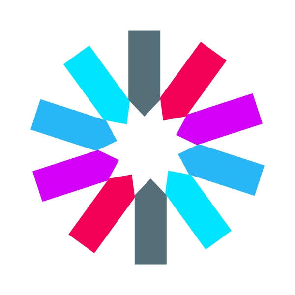
 | 

 

### Front-end
|     Html     |     CSS     |     JavaScript     |     React     |     Styled Components     |     axios     |      esLint     |     Figma     |     React Router     | typescript | redux |
| :----------------------------------------------------------: | :----------------------------------------------------------: | :----------------------------------------------------------: | :----------------------------------------------------------: | :----------------------------------------------------------: | :----------------------------------------------------------: | :----------------------------------------------------------: | :----------------------------------------------------------: | :----------------------------------------------------------: |:----------------------------------------------------------: | :----------------------------------------------------------: |
|  | 

 | 

 | 

 | 

 | 

 | 

 | 

 | 

 | 

 | 

 |

 

### Tools
| Github | Discord | Notion | 
| :--------: | :--------: | :------: |
|  |  |  |

 

## 🧑‍🤝‍🧑 Team members
| 이연수 (Be Leader) | 우성일 (BE) | 박호제 (BE) |
|:--------:| :--------: | :--------: |
| | 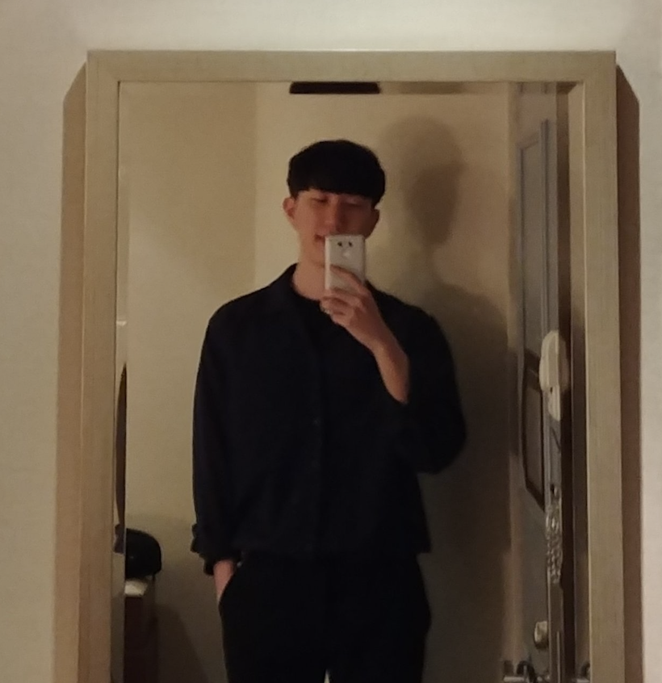 |  | 
|[@yeonssu](https://github.com/yeonssu) | [@wooniverse7](https://github.com/wooniverse7) | [@zini9188](https://github.com/zini9188) | 
| 
 - 카테고리 관련 기능 구현  - 게임 관련 기능 구현 - 북마크 기능 구현 - 첨부파일 AWS S3 업로드 - AWS 자동화 배포 | 
- 게시글 관련 기능 구현 - 댓글 관련 기능 구현 - 댓글 기능 고도화 (대댓글) | 
- 게임 팔로우 기능 구현 - 회원 팔로우 기능 구현  - oauth 기능 구현 - jwt 기능 구현 - 회원 관련 기능 구현 - 메시지 기능 구현 - AWS 자동화 배포 | 

| 김진완 (FE Leader) | 정우선 (FE) | 한수지 (FE) |
| :--------: | :--------: | :--------: |
| 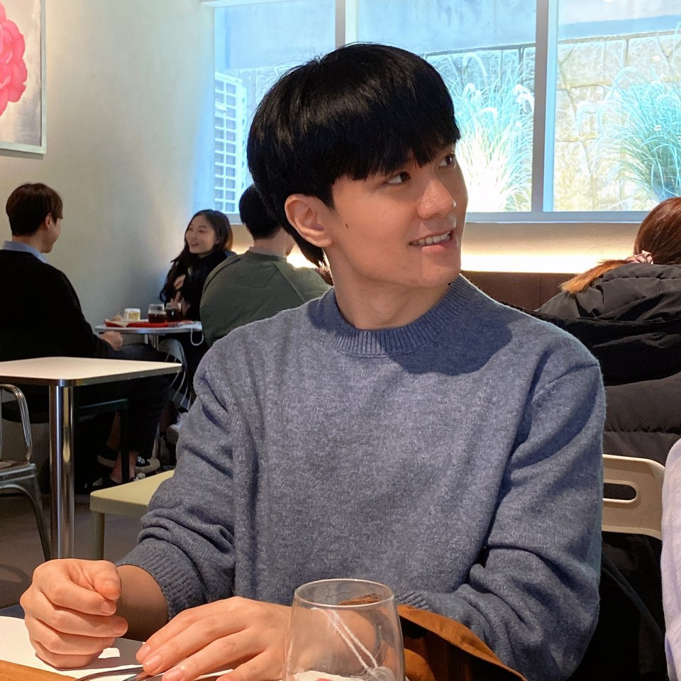 |  |  |
| [@crowwan](https://github.com/crowwan) | [@UseonJ](https://github.com/UseonJ) | [@nincoding](https://github.com/nincoding) |
| 
- 게시글 crud - 댓글 및 대댓글 crud - 게시글 좋아요 및 북마크 기능 - 채팅 기능  - 네비게이션바 ui  구현 및 기능 - 홈 화면 페이지네이션|
- 회원가입/로그인 페이지 - 게임등록 CRUD  - 게임등록 페이지 UI/기능 구현 - 검색결과 페이지 UI/기능 구현|
- 카테고리별 게임 UI 및 조회 R - 상세 게임 관련 UI 및 조회 R - 상세 회원 페이지 UI 및 기능 구현 R - 회원정보 수정 및 회원 탈퇴 기능 UD - 게임,유저 팔로우 및 언팔로우 기능 U|

 

## 📌 Introduction to Project Features

### 회원 기능
- 회원가입(인증코드 메일)  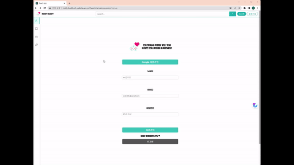
- 로그인  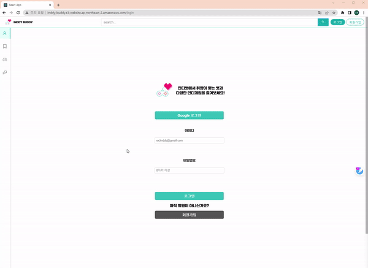
- 로그아웃  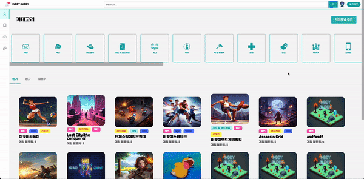
- 회원 정보 조회 (마이페이지/타유저페이지)  
- 회원 정보 수정  
- 비밀번호 변경  
- 회원 정보 삭제  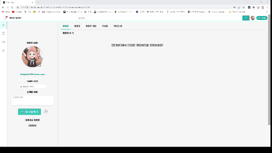

### 메인 기능
- 카테고리 페이지(메인 화면)  
- 게임 페이지  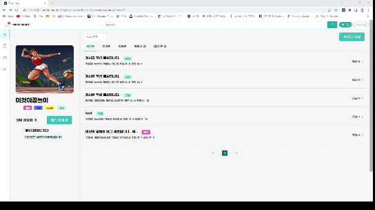
- 게임 등록  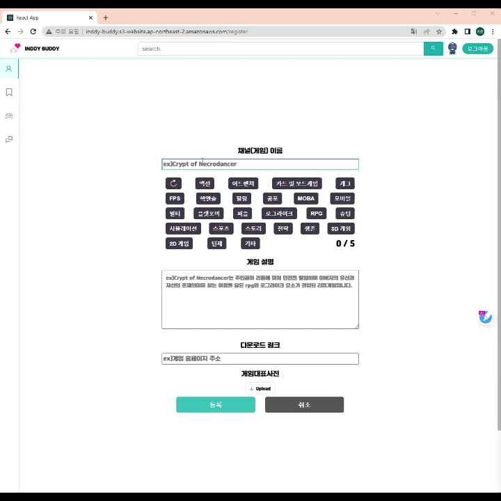

### 게시글 기능
- 게시글 댓글(대댓글) 작성, 좋아요, 북마크 기능  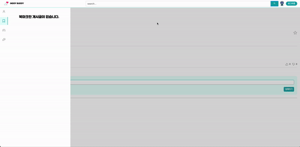
- 게시글 작성  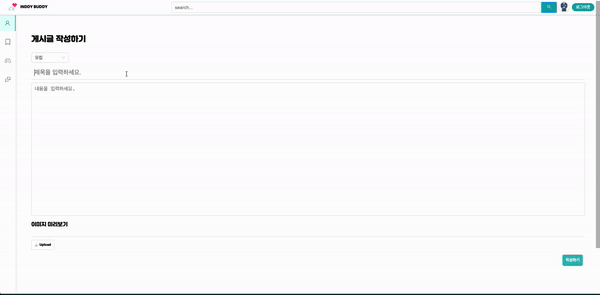

### 팔로우 기능
- 유저 팔로우 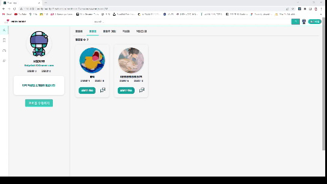
- 게임 팔로우 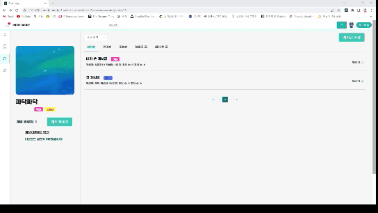

### 검색 기능
- 유저, 게임, 게시글 검색  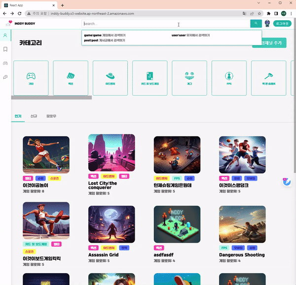

### 메시지(채팅) 기능
- 메시지 전송 및 확인  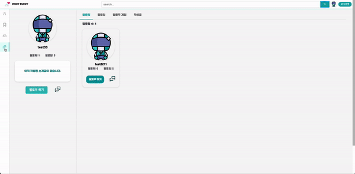

### 알림 기능
- 메시지, 댓글, 대댓글, 좋아요, 팔로우 시 알림

## 🔖 Project Docs

### 사용자 요구사항 정의서
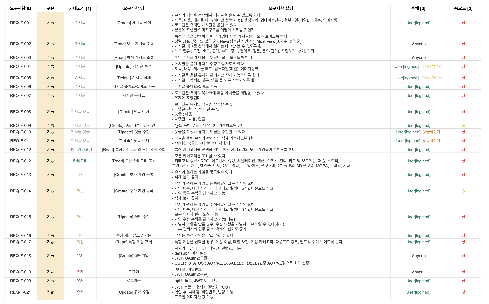
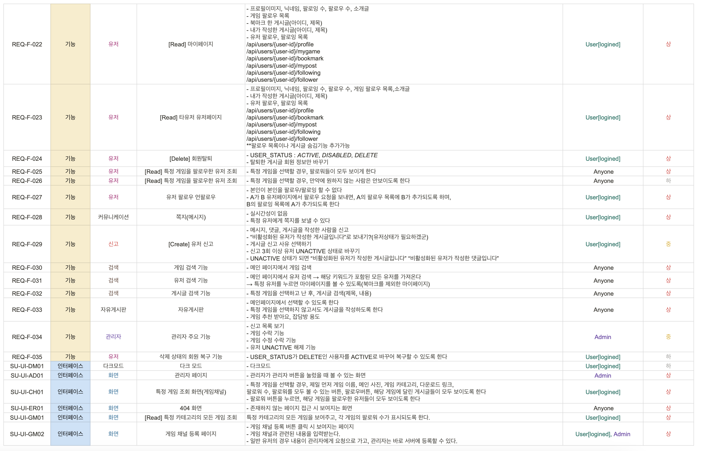
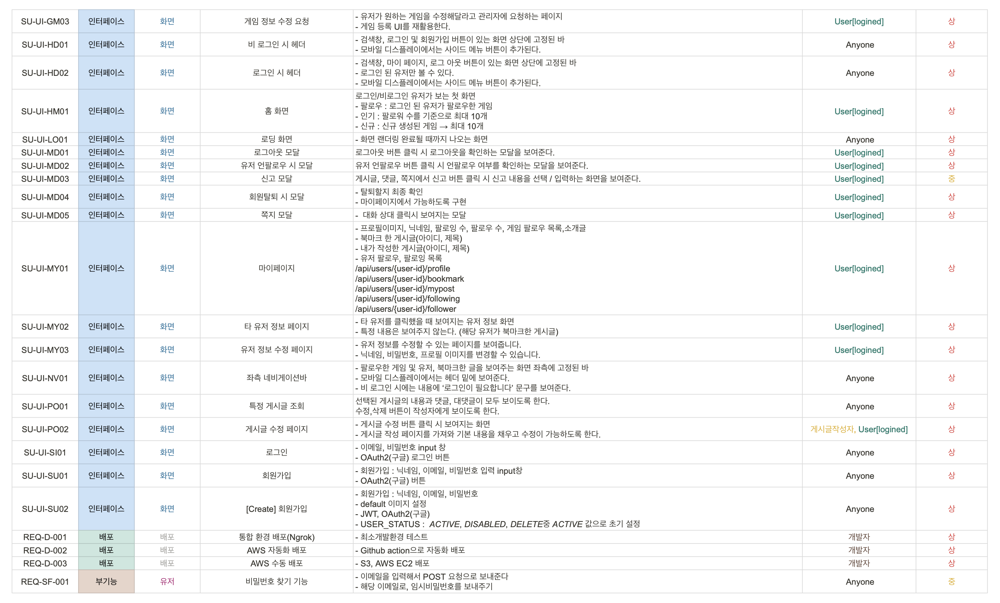
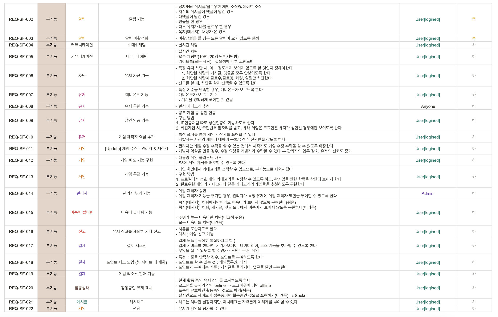

### DB Diagram

### Figma
[Wireframe Link (Figma)](https://www.figma.com/file/VzRAgvf5oXx476ylKOchHV/inddy-buddy?type=design&node-id=0-1&t=EqD0LKzE2oIl77L1-0)

 

## 📢 Github Rule

### Commit Convention

|  Message   | 설명                                                  |
| :--------: | :---------------------------------------------------- |
| `add` | 새로운 프로젝트, 파일 등 추가 |
| `feat` | 새로운 기능 추가 |
| `fix` | 버그 수정 |
| `refactor` | 코드 리팩토링 |
| `style` | 코드 포맷팅, 세미콜론 누락, 코드 스타일 변경 등 |
| `remove` | 사용하지 않는 파일 또는 폴더 삭제 |
| `rename` | 파일 또는 폴더명 수정 |
| `chore` | 빌드 업무 수정, 패키지 매니저 수정 |

### Branch

- `main` : 서비스 운영 브랜치 
- `dev` : 메인 브랜치 배포전 릴리즈 브랜치  
- `be-dev` : BE 개발 환경 브랜치 
- `fe-dev` : FE 개발 환경 브랜치
- `be-feat/[feature name]` : BE 기능 개발 브랜치
- `fe-feat/[feature name]` : FE 기능 개발 브랜치
